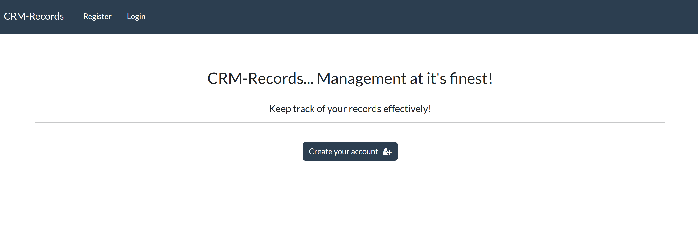
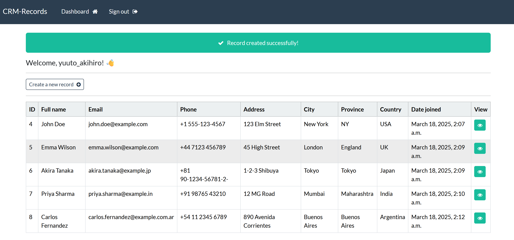
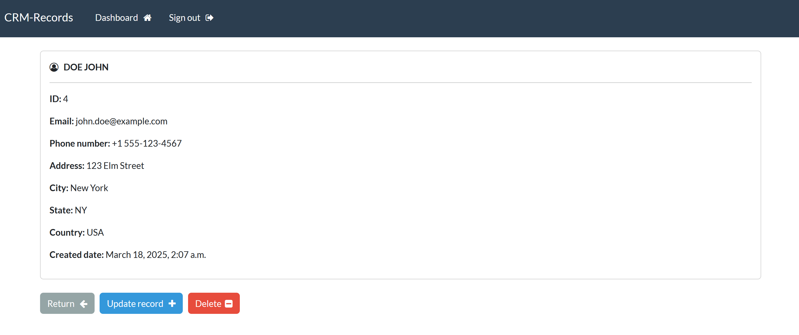
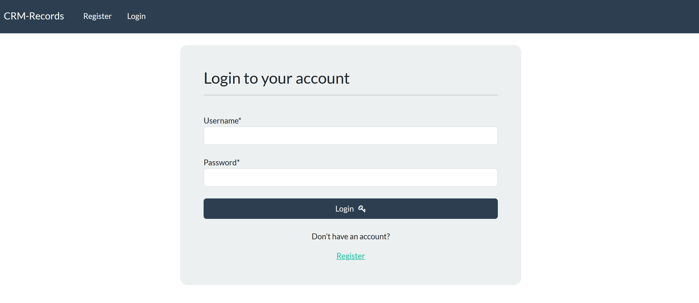
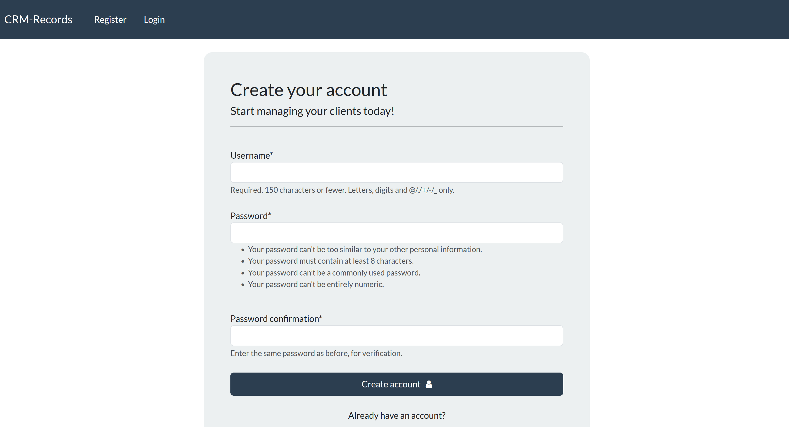

# CRM-Records App

- [Overview](#overview)
- [Installation and Usage](#installation-and-usage)
- [Usage Instructions](#usage-instructions)

---

## Overview
CRM-Records is a simple web application built using the Django framework. It allows users to perform CRUD (Create, Read, Update, Delete) operations on records and manage them efficiently. The system also includes user authentication with login and registration functionality.

---


## Project Preview
Below are some preview images showcasing the CRM-Records:







---

## Installation and Usage

1. **Clone the Repository:**  
```bash
 git clone https://github.com/yuutoa/crm-records-app.git
 cd CRMProject
```

2. **Create and Activate Virtual Environment:**  
```bash
python -m venv venv
venv\Scripts\activate  # On MacOS or Linux use: source venv/bin/activate
```

3. **Install Dependencies:**  
```bash
pip install -r requirements.txt
```

4. **Apply Migrations:**  
```bash
python manage.py migrate
```

5. **Run the Application:**  
```bash
python manage.py runserver
```

6. **Access the Application:**  
Open your browser and go to: [http://127.0.0.1:8000](http://127.0.0.1:8000)

---

## Usage Instructions
- Register a new account or log in if you already have one.
- Create, view, update, or delete records as needed.
- View and manage records from your personal dashboard.

---

[Yuuto Akihiro](https://github.com/yuutoa)

